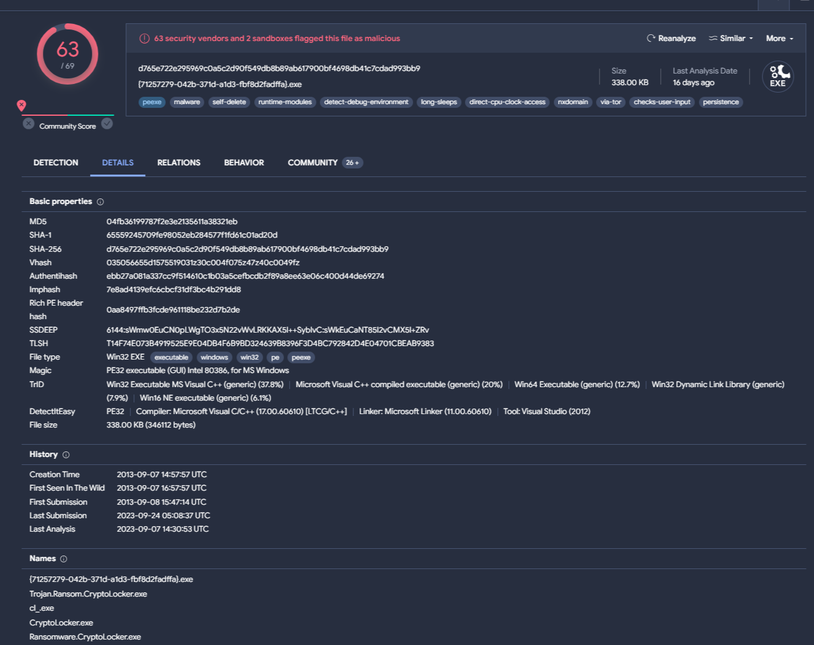

# CryptoLocker (Ransomware)

## Fingerprint

MD5: `04fb36199787f2e3e2135611a38321eb`

SHA1: `65559245709fe98052eb284577f1fd61c01ad20d`

SHA256: `d765e722e295969c0a5c2d90f549db8b89ab617900bf4698db41c7cdad993bb9`

SHA512: `533d6603f6e2a77bd1b2c6591a135c4717753d53317c1be06e43774e896d9543bcd0ea6904a0688aa84b2d8424641d68994b1e7dc4aa46d66c36feecb6145444`

File Name: `{71257279-042b-371d-a1d3-fbf8d2fadffa}.exe`

File Type: `32-bit Windows Executable`

Size: `338 KB`

Compiler Timestamp: `Sat Sep 07 14:57:57 2013 | UTC`

## Static Analysis

The full virus total report is available [here](https://www.virustotal.com/gui/file/d765e722e295969c0a5c2d90f549db8b89ab617900bf4698db41c7cdad993bb9/details)



### Libraries and Functions

#### Imported Libraries

- **CRYPT32.dll**
- **WINHTTP.dll**
- ADVAPI32.dll
- KERNEL32.dll
- USER32.dll
- SHELL32.dll
- SHLWAPI.dll
- msvcrt.dll
- UxTheme.dll
- GDI32.dll

Performing a basic static analysis using `pestudio` we can see that the executable imports `crypt32.dll` which is used for cryptographic operations, and also imports `winhttp.dll` in order to communicate with this IP address `184[.]164[.]136[.]134`.

Analysing the executable further we found out that the executable utilizes the registry for persistence and storing information, since the following functions were imported from the `ADVAPI32.dll` library:

- RegSetValueExW
- RegFlushKey
- RegCreateKeyExW
- RegDeleteKeyW
- RegDeleteValueW
- RegEnumKeyExW
- RegCloseKey
- RegQueryValueExW
- RegQueryInfoKeyW
- RegEnumValueW
- RegOpenKeyExW

#### Notable imported functions

**Functions used for enumeration/manipulation/execution of files**

| Function | Library |
| --- | --- |
| GetEnvironmentVariableW | KERNEL32.dll |
| FindFirstFileW | KERNEL32.dll |
| FindNextFileW | KERNEL32.dll |
| DeleteFileW | KERNEL32.dll |
| WriteFile | KERNEL32.dll |
| SetFileAttributesW | KERNEL32.dll |
| MoveFileExW | KERNEL32.dll |
| CreateProcessW | KERNEL32.dll |
| GetCurrentThreadId | KERNEL32.dll |
| GetCurrentThread | KERNEL32.dll |
| ShellExecuteExW | SHELL32.dll |
| SHGetFileInfoW | SHELL32.dll |
| PathFindFileNameW | SHLWAPI.dll |
| PathRemoveFileSpecW | SHLWAPI.dll |

**Functions used for http/https connection**

| Function | Library |
| --- | --- |
| WinHttpOpen | WINHTTP.dll |
| WinHttpConnect | WINHTTP.dll |
| WinHttpCloseHandle | WINHTTP.dll |
| WinHttpQueryHeaders | WINHTTP.dll |
| WinHttpWriteData | WINHTTP.dll |
| WinHttpReadData | WINHTTP.dll |
| WinHttpAddRequestHeaders | WINHTTP.dll |
| WinHttpSendRequest | WINHTTP.dll |
| WinHttpReceiveResponse | WINHTTP.dll |

**Functions used for cryptographic operations**

| Function | Library |
| --- | --- |
| CryptImportPublicKeyInfo | CRYPT32.dll |
| CryptStringToBinaryA | CRYPT32.dll |
| CryptDecodeObjectEx | CRYPT32.dll |
| CryptAcquireContextW | ADVAPI32.dll |
| CryptSetKeyParam | ADVAPI32.dll |
| CryptGetKeyParam | ADVAPI32.dll |
| CryptReleaseContext | ADVAPI32.dll |
| CryptImportKey | ADVAPI32.dll |
| CryptEncrypt | ADVAPI32.dll |
| CryptGenKey | ADVAPI32.dll |
| CryptDestroyKey | ADVAPI32.dll |
| CryptDecrypt | ADVAPI32.dll |
| CryptGetHashParam | ADVAPI32.dll |
| CryptCreateHash | ADVAPI32.dll |
| CryptDestroyHash | ADVAPI32.dll |
| CryptHashData | ADVAPI32.dll |
| CryptExportKey | ADVAPI32.dll |

**Functions used for registry enumration/modification**

| Function | Library |
| --- | --- |
| RegSetValueExW  | ADVAPI32.dll |
| RegFlushKey | ADVAPI32.dll |
| RegCreateKeyExW | ADVAPI32.dll |
| RegDeleteKeyW | ADVAPI32.dll |
| RegDeleteValueW | ADVAPI32.dll |
| RegEnumKeyExW | ADVAPI32.dll |
| RegCloseKey | ADVAPI32.dll |
| RegQueryValueExW | ADVAPI32.dll |
| RegQueryInfoKeyW | ADVAPI32.dll |
| RegEnumValueW | ADVAPI32.dll |
| RegOpenKeyExW | ADVAPI32.dll |

*Provided withing this folder the output of `capa`,  capa_cryptlock_output.txt. Which provides additional information to the capabilities of this executable.*

### Strings

Using `floss` to analyze the strings we found the following registry keys:

- Software\Microsoft\Windows\CurrentVersion\Run **(Persistence)**
- Software\CryptoLocker
- Software\CryptoLocker\Files

And we also found that the author of the malware demands payment as follows:

| Amount | Currency |
| --- | --- |
| 300 | USD |
| 300 | EUR |
| 300 | AUD |
| 600 | BRL |
| 300 | CAD |
| 6000 | CZK |
| 3000 | DKK |
| 300 | GBP |
| 3000 | MXN |
| 4500 | NOK |
| 600 | NZD |
| 1500 | PLN |
| 600 | RON |
| 4500 | SEK |
| 2 | BTC |

They accept payments through the following payment services:

```
Choose a convenient payment method:
MoneyPak (USA only)
Ukash
CashU
Bitcoin (most cheap option)
```

We found multiple strings indicating that the malware encrypts files using a 2048-bit public/private key:

```
Microsoft Enhanced RSA and AES Cryptographic Provider
```

```
Encryption was produced using a \b unique\b0  public key \cf2\ul\b{\field{\*\fldinst{HYPERLINK "http://en.wikipedia.org/wiki/RSA_%28algorithm%29"}}{\fldrslt{RSA-2048}}}\cf1\ulnone\b0\f0\fs20  generated for this computer.
```

## Dynamic Analysis

Here are the findings after the executable was run in a `Windows 10 Home` virtual machine:

1. The executable moved itself to `%user%\AppData\Roaming\{34184A33-0407-212E-3307-01081C02E2C2}.exe`
2. It started modifying the registry, establishing persistence by adding the key `CryptoLocker` to  `HKEY_CURRENT_USER\SOFTWARE\Microsoft\Windows\CurrentVersion\Run` that points to the location it moved to (See point 1)

3. The executable started enumerating the registry, some of the keys enumerated

    - `HKLM\SOFTWARE\Policies\Microsoft\Windows\CurrentVersion\Internet Settings`
    - `HKCU\SOFTWARE\Microsoft\Internet Explorer\Security`
    - `HKLM\SOFTWARE\WOW6432Node\Microsoft\Windows\Tablet PC\IsTabletPC`
    - `HKLM\System\CurrentControlSet\Control\FileSystem`
    - `HKLM\SOFTWARE\Policies\Microsoft\Windows\safer\codeidentifiers`
    - `HKCU\Control Panel\Desktop\MuiCached\MachinePreferredUILanguages`
    - `HKLM\System\CurrentControlSet\Control\MUI\UILanguages\en-US`
    - **`HKCU\SOFTWARE\Microsoft\Cryptography\MachineGuid`**
    - **`HKLM\SOFTWARE\WOW6432Node\Microsoft\Cryptography\Defaults\Provider\Microsoft Enhanced RSA and AES Cryptographic Provider\Image Path`**
4. The executable then started using 32-bit DLLs present in `%windir%\SysWOW64`
5. We can note the loading of the `C:\Windows\SysWOW64\crypt32.dll` library used for encrypting files

6. The executable started contacting the IP `184[.]164[.]136[.]134`

7. The executable started querying dns for 329 unique domain names, (listed in the contacted_domains.txt)

## Notes

The analyzed sample is provided within this folder, the password for the zip file is `infected`.
This sample was taken from [theZoo](https://github.com/ytisf/theZoo/) Repository.
